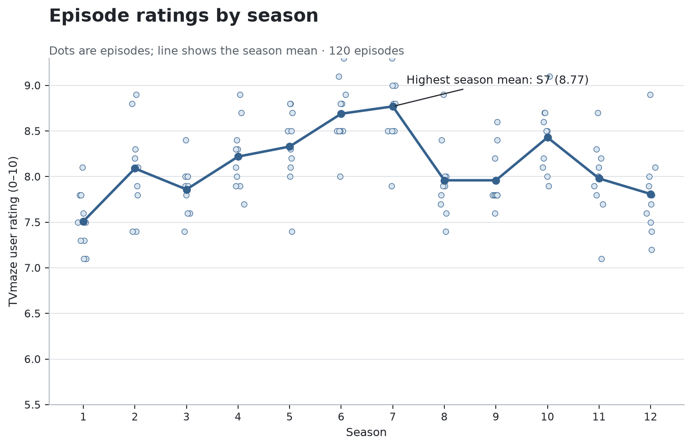
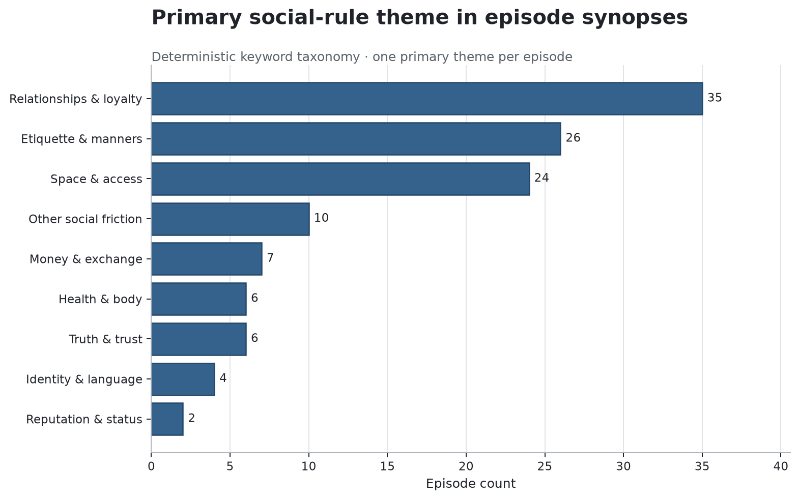
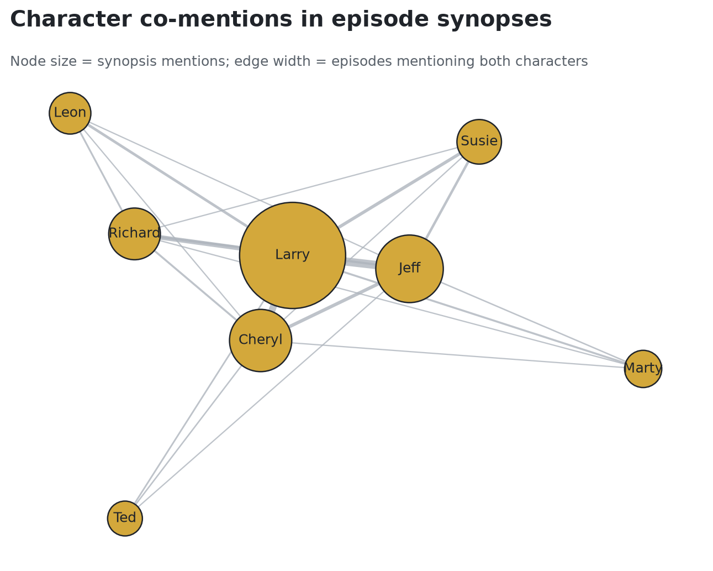

# Curb Conflict Atlas

An episode-level data science project about the social rules, escalating misunderstandings, and recurring character relationships behind *Curb Your Enthusiasm*.

> **Current scope:** this first release analyzes public episode metadata and short synopses. It does not redistribute copyrighted transcripts.



## Results at a glance

| Finding | Result |
| --- | ---: |
| Episodes / seasons | 120 / 12 |
| Mean episode rating | 8.13 |
| Highest season mean | Season 7 · 8.77 |
| Highest-rated episode | S07E05 · Denise Handicapped · 9.4 |
| Most common primary theme | Relationships & loyalty · 35 episodes |
| Friction score vs. rating | Spearman ρ = 0.08 |

The weak correlation is an important result: synopsis-level friction language does not, by itself, identify a highly rated episode.

## The question

How does an ordinary social irritation become a full-scale *Curb* conflict—and are synopsis-level signals of friction associated with how viewers rate an episode?

## What the project includes

- A reproducible TVmaze ingestion pipeline covering all 120 regular episodes
- A transparent eight-category social-rule taxonomy
- A documented synopsis friction score
- Season-level rating analysis and character co-mention network
- An executed, reader-facing Jupyter notebook
- Reusable Python modules, data-quality checks, generated outputs, and tests

## Project structure

```text
.
├── data/                  # Source snapshot, normalized metadata, taxonomy, provenance
├── notebooks/             # Executed reader-facing analysis
├── outputs/               # Features, metrics, edges, and charts
├── scripts/               # Notebook builder
├── src/                   # Data, features, analysis, visualization, pipeline
├── tests/                 # Unit and integrity checks
├── ANNOTATION_GUIDE.md     # Protocol for the future Larry Vindication Score
├── DATA_CARD.md           # Provenance, intended use, and limitations
└── requirements.txt
```

## Reproduce

```bash
python3 -m venv .venv
.venv/bin/pip install -r requirements.txt
.venv/bin/python -m src.pipeline --refresh
.venv/bin/python scripts/build_notebook.py
JUPYTER_PATH=.venv/share/jupyter MPLCONFIGDIR=.mplconfig IPYTHONDIR=.ipython .venv/bin/python -m jupyter nbconvert --execute --to notebook --inplace notebooks/curb_conflict_atlas.ipynb
.venv/bin/python -m unittest discover -s tests -v
```

## Interpretation guardrails

The taxonomy and friction score are synopsis-level heuristics, not ground-truth annotations. Ratings are observational and mutable. The analysis is designed to surface patterns and questions, not prove that a writing device caused audience response.

The next release will use the review protocol in [`ANNOTATION_GUIDE.md`](ANNOTATION_GUIDE.md) to build a defensible Larry Vindication Score and callback analysis.





## Sources

- [TVmaze API](https://www.tvmaze.com/api)
- [Curb Your Enthusiasm on TVmaze](https://www.tvmaze.com/shows/551/curb-your-enthusiasm)
- Inspiration: [The Seinfeld Chronicles](https://github.com/4m4n5/the-seinfeld-chronicles)

## License

Code is released under the MIT License. Source data remains subject to its provider's terms.
